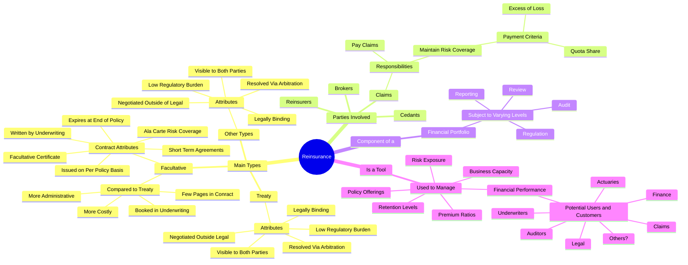

```mermaid
mindmap
  root((Reinsurance))
    Main Types
      Treaty
        Attributes
            Legally Binding
            Negotiated Outside Legal
            Low Regulatory Burden
            Visible to Both Parties
            Resolved Via Arbitration

      Facultative
        Compared to Treaty
            More Costly
            More Administrative
            Few Pages in Conract
            Booked in Underwriting

        Contract Attributes
            Written by Underwriting
            Ala Carte Risk Coverage
            Short Term Agreements
            Issued on Per Policy Basis
            Expires at End of Policy
            Facultative Certificate

      Other Types
        Attributes
            Legally Binding
            Negotiated Outside of Legal
            Low Regulatory Burden
            Visible to Both Parties
            Resolved Via Arbitration

        
    Parties Involved
      Reinsurers
      Cedants
      Brokers
      Claims
        Responsibilities
            Pay Claims
            Maintain Risk Coverage
                Payment Criteria
                    Excess of Loss
                    Quota Share
        

    Component of a
        Financial Portfolio
            Subject to Varying Levels
                Regulation 
                Reporting
                Review
                Audit
    
    Is a Tool
      Used to Manage
        Business Capacity
        Policy Offerings
        Risk Exposure
        Premium Ratios
        Retention Levels
        Financial Performance  
            Potential Users and Customers
                Underwriters
                Actuaries
                Finance
                Legal
                Auditors
                Claims
                Others? 
            
```
