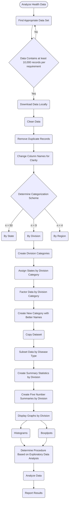

#### This is a flowchart demonstrating the data cleaning and analysis process for my final project in the Statistics II course at WakeTech.

```mermaid
---
config:
  layout: dagre
---

flowchart TD
    A(["Analyze Health Data"]) --> Z("Find Appropriate Data Set")
    Z --> B{"Data Contains at least 
  10,000 records per requirement"}
    B -- Yes --> C("Download Data Locally")
    B -- No --> Z
    C --> D("Clean Data")
    D --> E("Remove Duplicate Records")
    E --> F("Change Column Names for Clarity")
    F --> G{"Determine Categorization Scheme"}
    G -- n = 50 --> H("By State")
    G -- n = 9 --> I("By Division")
    G -- n = 4 --> J("By Region")
    I --> K("Create Division Categories")
    K --> L("Assign States by Division Category")
    L --> M("Factor Data by Division Category")
    M --> N("Create New Category with Better Names")
    N --> O("Copy Dataset")
    O --> P("Subset Data by Disease Type")
    P --> Q("Create Summary Statistics by Division")
    Q --> R("Create Five Number Summaries by Division")
    R --> S("Display Graphs by Division")
    S --> T("Boxplpots") & U("Histograms")
    U --> V("Determine Procedure Based on Exploratory Data Analysis")
    T --> V
    V --> W("Analyze Data")
    W --> X("Report Results")
    style A stroke:#424242
    style Z stroke:#424242
    style B stroke:#424242
    style C stroke:#424242
    style D stroke:#424242
    style E stroke:#424242
    style F stroke:#424242
    style G stroke:#424242
    style H stroke:#424242
    style I stroke:#424242
    style J stroke:#424242
    style K stroke:#424242
    style L stroke:#424242
    style M stroke:#424242
    style N stroke:#424242
    style O stroke:#424242
    style P stroke:#424242
    style Q stroke:#424242
    style R stroke:#424242
    style S stroke:#424242
    style T stroke:#424242
    style U stroke:#424242
    style V stroke:#424242
    style W stroke:#424242
    style X stroke:#424242
```